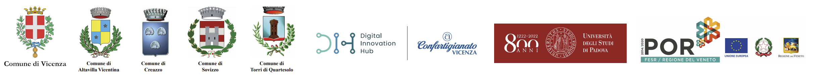

# Infografiche per InnovationLab Vicenza

Un paragrafo della descrizione del progetto va qui.

> Il progetto è parte del Operativo Regionale del Fondo Europeo di Sviluppo Regionale (POR FESR 2014 - 2020) del Veneto, nell'ambito del bando dell'azione 231 volto alla "costituzione di Innovation Lab diretti al consolidamento/sviluppo del network Centri P3@-Palestre Digitali e alla diffusione della cultura degli Open Data."



## Sommario

- [Guida introduttiva](#guida-introduttiva)
- [Avviare i test](#avviare-i-test)
- [Uso](#uso)
- [Roadmap](#roadmap)
- [Versioning](#versioning)
- [Contatti](#contatti)
- [Licenza](#licenza)
- [Riconoscimenti](#riconoscimenti)

## Guida introduttiva

Queste istruzioni ti porterà una copia del progetto su e funzionante La tua
macchina locale per scopi di sviluppo e test. Vedi Distribuzione Per le note su
come distribuire il progetto su un sistema live.


* `/data`
  * `/input`
    * `ghm.tif` - gHM (Global Human Modification Index) o l'indice della pressione antropica che fornisce una misura cumulativa della modifica umana delle terre a livello di risoluzione di 1 km<sup>2</sup>. I valori gHM variano da `0,0` a `1,0` e sono calcolati stimando la proporzione di una determinata posizione (pixel) che viene modificata. Licenza [CC BY-NC-SA](https://creativecommons.org/licenses/by-nc-sa/2.0/). Ottenuto tramite [Google Earth Engine](https://developers.google.com/earth-engine/datasets/catalog/CSP_HM_GlobalHumanModification). Attributo: *Kennedy, C.M., J.R. Oakleaf, D.M. Theobald, S. Baurch-Murdo, and J. Kiesecker. 2019. Managing the middle: A shift in conservation priorities based on the global human modification gradient. Global Change Biology 00:1-16. https://doi.org/10.1111/gcb.14549.*
    * `istat_codici_prov.csv` - Codici statistici e denominazioni delle ripartizioni sovracomunali dall'Istat. L'encoding è stato convertito in UTF-8. Ottenuto tramite https://www.istat.it/it/archivio/6789
    * `istat_comuni2021.zip` - archivio ZIP che contiene uno Shapefile dall'Istat di limiti amministrativi di tutti i comuni italiani, riproiettati in EPSG:4326 con una correzione di geometrie corrotte. L'encoding è stato convertito in UTF-8. Fonte: https://www.istat.it/it/archivio/222527
    * `istat_pop2019.csv` - i dati Istat del censimento della popolazione 2019. L'encoding è stato convertito in UTF-8. Ottenuto tramite http://dati-censimentipermanenti.istat.it.
    * `pvout.tif` - potenziale solare fotovoltaico annuo, **kWh/m<sup>2</sup>**. Licenza [CC BY 4.0](https://creativecommons.org/licenses/by/4.0/). Attributo: *I dati ottenuti dalla Global Solar ATLAS 2.0, una Web App gratuita, sviluppata e gestita dalla società SolarGis s.r.o. a nome del Gruppo della Banca mondiale, utilizzando i dati di Solargis, con finanziamenti forniti dal programma di assistenza per il settore dell'energia (ESMAP). Per ulteriori informazioni: https://globalsolaratlas.info*
    * `viirs.tif` - immagine composita di radianza mediana annua, **nW/(cm<sup>2</sup>×sr)**, creata dai dati dell'osservazione notturna della Terra **VIIRS Stray Light Corrected Nighttime Day/Night Band Composites Version 1** tramite [Google Earth Engine](https://developers.google.com/earth-engine/datasets/catalog/NOAA_VIIRS_DNB_MONTHLY_V1_VCMSLCFG).
    * `worldpop.tif` - WorldPop Global Project Population Data: popolazione residenziale stimata per 2020 su una grigliata di 100x100 m. Licenza [CC BY 4.0](https://creativecommons.org/licenses/by/4.0/). Attributo: www.worldpop.org

### Prerequisiti

Quali cose è necessario installare il software e come installarli.

    Dare esempi

### Installazione


1. Prima di tutto installa **Microsoft Visual C++** 14.0 (o maggiore). Scaricalo con lo strumento ["Microsoft C++ Build Tools"](https://visualstudio.microsoft.com/visual-cpp-build-tools/). 
   
2. Bisogna installare le seguenti librerie in ordine. Puoi usare la cartella ` processing/depenencies` che contiene i file necessari (Python Wheels) compatibili con la versione specifica del Python e architettura dell'OS: in questo caso è Windows x64, Python 3.7 o Python 3.8. Altrimenti scarica i Wheel dall'[Unofficial Windows Binaries for Python Extension Packages](https://www.lfd.uci.edu/~gohlke/pythonlibs/).

```
pip install processing\dependencies\GDAL-3.2.2-cp39-cp39-win_amd64.whl
pip install processing\dependencies\pyproj-3.0.1-cp39-cp39-win_amd64.whl
pip install processing\dependencies\Fiona-1.8.18-cp39-cp39-win_amd64.whl
pip install processing\dependencies\Shapely-1.7.1-cp39-cp39-win_amd64.whl
pip install processing\dependencies\geopandas-0.9.0-py3-none-any.whl
pip install processing\dependencies\Rtree-0.9.7-cp39-cp39-win_amd64.whl
pip install processing\dependencies\rasterio-1.2.1-cp39-cp39-win_amd64.whl
   
pip install requests rasterstats
```

L'ultima libreria viene installata dall'internet, dunque non specifichiamo nessun file.

## Uso

Utilizzare questo spazio per mostrare esempi utili di come può essere utilizzato
un progetto. Ulteriori screenshots, esempi di codice e demo funzionano bene in
questo spazio. Puoi anche collegarti a più risorse.

Per ulteriori esempi, fare riferimento alla documentazione.

## Roadmap

Vedi [issues](https://github.com/dihvicenza/infografiche-vi/issues) aperti per
un elenco di miglioramenti proposti (e problemi noti).

## Versioning

Usiamo [SemVer](http://semver.org/) per il versioning. Per le versioni
disponibili, vedere
i [tag su questo repository](https://github.com/dihvicenza/infografiche-vi/tags)
.

## Contatti

- Sito
  aziendale: [Digital Innovation Hub Vicenza](https://digitalinnovationhubvicenza.it/)
- Sviluppatore: [Yaroslav Vasyunin](https://www.linkedin.com/in/vasyunin)
- Project
  Link: [https://github.com/dihvicenza/infografiche-vi](https://github.com/dihvicenza/infografiche-vi)

## Licenza

Questo progetto è concesso in licenza sotto la GNU GPL versione 3: vedi il
file [LICENSE](LICENSE) per dettagli.

## Riconoscimenti

- Suggerimento del cappello a chiunque sia stato utilizzato il codice
- Ispirazione
- eccetera